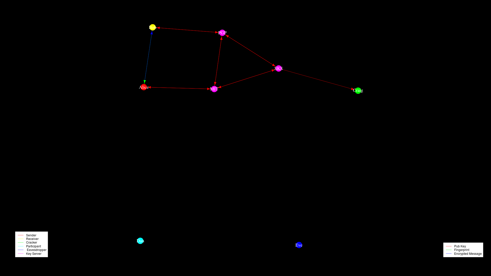
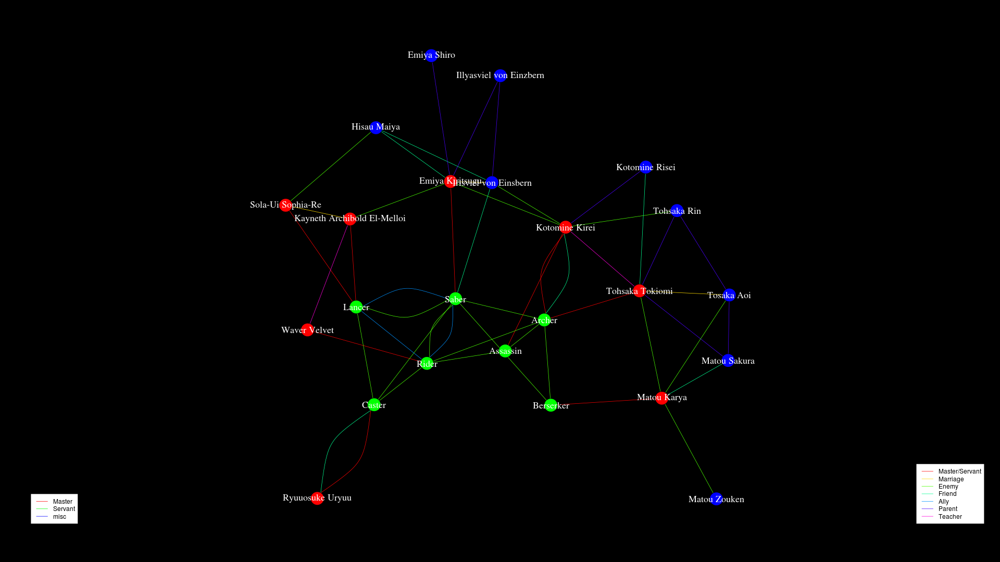

# Network Graph Generator
## An R script to generate network graphs of relationships

network-graph-gen.R reads two csv files, an edge list and a vertex list,
and uses [igraph](http://igraph.org/) to generate a network graph
showing the relations in the edge list between the vertices in the vertex list.
Edges and vertices are color coded according to the `relation` and
`vertexType` columns respectively.
Legends are created for both edges and vertices showing the colors
that were assigned to then.

## Usage
### Input data
The edge list and vertex list should be placed in the files
"edgeList.csv" and "vertexList.csv" respectively.
Alternatively, the lines
```R
edges <- read.csv("edgeList.csv")
vertices <- read.csv("vertexList.csv")
```
can be edited to names of your data files.

### Directional
By default, igraphs sets `directed=TRUE`.
This means that edges are considered to show one-way relationships.
If you wish to show bidirectional relationships, set `directed=FALSE`

# Examples
Directed graph using the included example data.


Bidirectinal example using Fate/Zero characters.

